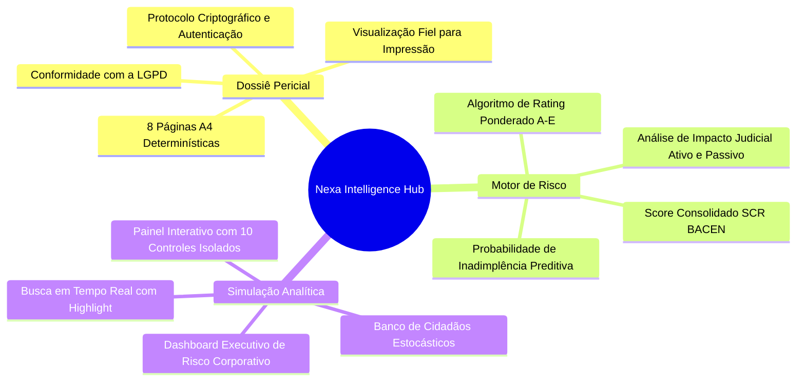

# 01 - Visão Estratégica

## 1. Missão do Produto
O **Nexa Risk Intelligence Hub (Relatório de Perícia de Crédito)** foi concebido para transformar análises cadastrais e creditícias brutas em um dossiê corporativo auditável, executivo e de alta fidelidade visual, capaz de orientar decisões de crédito de alto valor financeiro com precisão milimétrica.

A plataforma unifica duas necessidades críticas do mercado financeiro:
1. **Visualização Analítica Interativa:** Dashboard corporativo em tempo real para auditoria instantânea de scores, volumetria de restrições e comprometimento de risco.
2. **Perícia Documental Impressa (Padrão A4):** Renderização determinística de 8 páginas no padrão universal A4 (210mm × 297mm), desenhado para validade jurídica, conformidade com a LGPD e consulta em formato físico ou PDF exportável.

---

## 2. Mapa Mental Estratégico

---

## 3. Diretrizes Arquiteturais para Longa Sobrevivência (10+ Anos)
- **Desacoplamento de Framework:** Regras de negócio de crédito (escalonamento temporal, somatórios e ratings) são puras e residem na camada de domínio (`src/domain/services/`), isoladas de hooks ou do DOM.
- **Renderização Nativa:** Ausência de bibliotecas pesadas de geração de PDF no cliente que corrompem fontes ou tabelas; a geração de PDF ancora-se no subsistema nativo do browser (`window.print()` sob `@media print`), garantindo nitidez vetorial indefinidamente.
- **Consistência de Estado Sem Prop Drilling:** Estado global orquestrado via React Context API com granularidade de memoização via `useMemo` para suportar computação fluida mesmo em dispositivos de baixo processamento.
