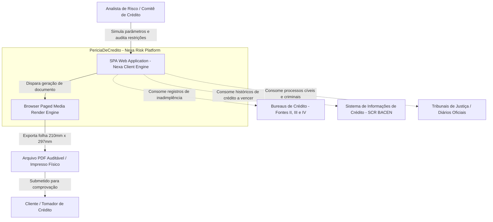

# 02 - Ecossistema / C4 L1

## 1. Diagrama de Contexto de Sistema (C4 L1)

O ecossistema posiciona o **Relatório de Perícia de Crédito** no centro do processo decisório entre analistas, bureaus e comitês de compliance.

---

## 2. Atores e Responsabilidades
- **Analista de Risco:** Operador corporativo que avalia pendências, aplica filtros por entidade credora, calibra cenários de estresse de score e emite pareceres.
- **Bureaus de Crédito (Fontes II, III e IV):** Entidades provedoras de pendências financeiras comerciais, restrições cadastrais, títulos protestados e cheques sem provisão de fundos (Motivo 12).
- **Sistema SCR (Banco Central do Brasil):** Registro centralizado que consolida coobrigações, operações ativas por modalidade e montantes a vencer.
