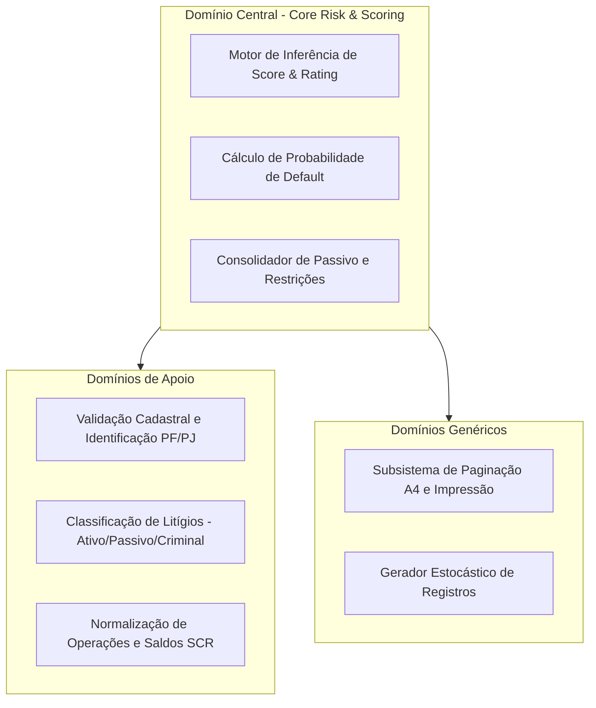

# 03 - Domínios

A decomposição por Domínios segue os princípios do *Domain-Driven Design (DDD)*, isolando as responsabilidades de negócio do sistema.

---

## Detalhamento dos Domínios
1. **Core Risk & Scoring:** Responsável pela ponderação algorítmica do Score (0–1000), definição da Régua de Ratings (A a E) e consolidação do montante total restritivo.
2. **Cadastral & Identification:** Normaliza documentos (CPF/CNPJ), dados biográficos, telefones e endereços fiscais.
3. **Legal / Judicial:** Discrimina se o titular atua em Polo Ativo ou Passivo, se há impacto lesivo ao crédito ou repercussão criminal/reputacional.
4. **BACEN SCR:** Estrutura créditos a vencer por faixa de prazo (30, 60, 90, 180, 360+ dias) e detalha garantias ou restritivos por instituição financeira.
