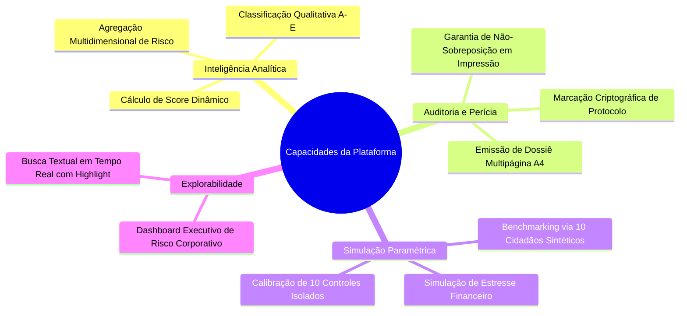

# 04 - Capacidades

As capacidades do sistema definem os serviços entregues pela arquitetura tanto para os operadores de negócio quanto para os componentes de software.

---

## Matriz de Capacidades

| ID | Capacidade | Módulo Responsável | Nível de Criticidade |
| :--- | :--- | :--- | :--- |
| **CAP-01** | Paginação A4 Determinística | `src/components/organisms/ReportPages/` | Crítica |
| **CAP-02** | Sincronização Reativa Unidirecional | `src/state/CreditReportContext.tsx` | Alta |
| **CAP-03** | Escalonamento Estocástico de Dados | `src/domain/services/credit-simulation.service.ts` | Média |
| **CAP-04** | Normalização e Ponderação de Ratings | `src/utils/rating.ts` | Crítica |
| **CAP-05** | Realce Textual Semântico (Highlight) | `A4Pages.tsx` + Regex Parser | Baixa |
