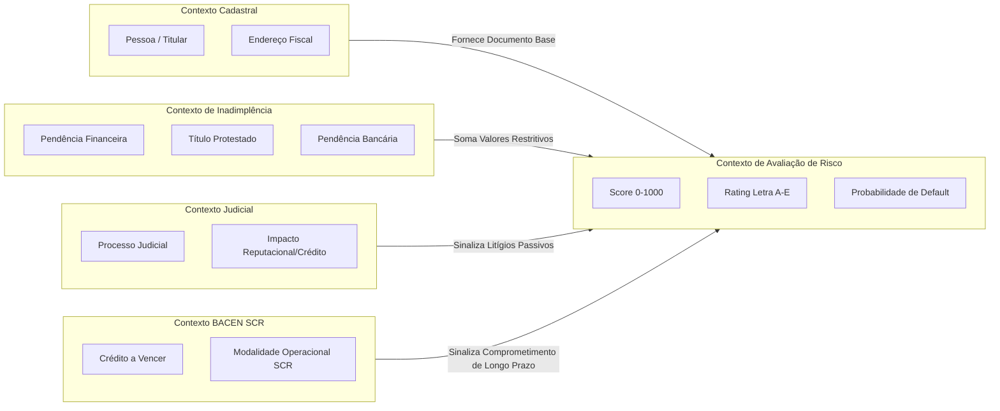

# 05 - Bounded Contexts

O isolamento contextual evita contaminação de modelos ubíquos entre os diferentes módulos da plataforma.

---

## Contratos de Contexto
- **Linguagem Ubíqua Comum:** O termo *Ocorrência* no contexto de Inadimplência representa uma anotação em bureau com valor nominal positivo; no contexto de BACEN SCR, representa um apontamento de operação com classificação de restritividade (Sim/Não).
- **Anti-Corruption Layer (ACL):** Implementada no domínio de simulação (`credit-simulation.service.ts`), que sanitiza registros brutos e os converte em coleções de tipos definidos em `src/types.ts`.
