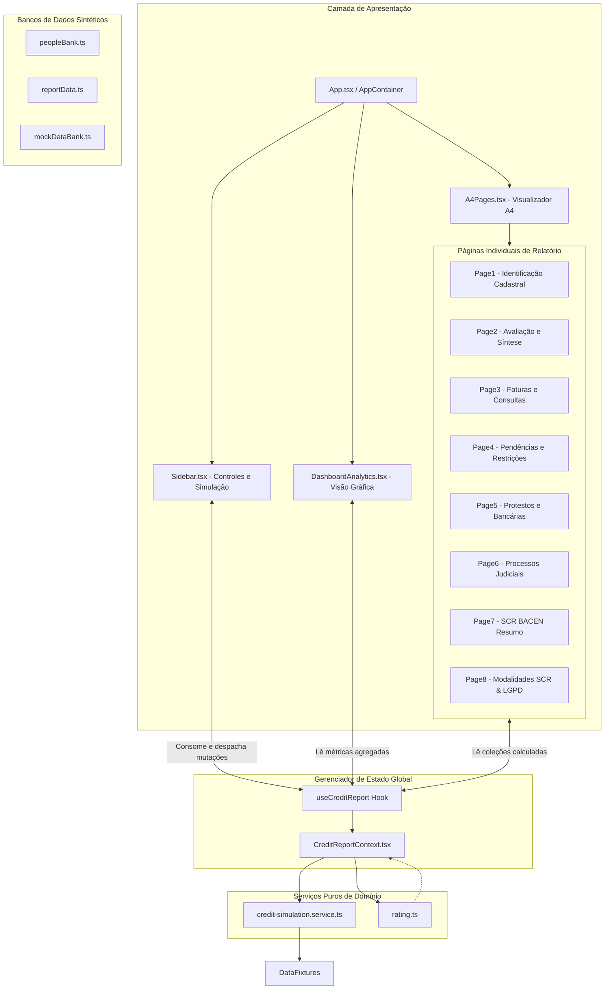

# 06 - Componentes / C4 L3

A arquitetura do front-end está estruturada em três camadas principais: Apresentação, Orquestração de Estado e Serviços de Domínio.

---

## Responsabilidades dos Componentes Principais
- **`CreditReportContext`:** Mantém a fonte única da verdade, sincroniza seleções de cidadãos com inputs do usuário e executa memoizações pesadas (`useMemo`) para evitar *re-renders* redundantes.
- **`credit-simulation.service.ts`:** Gera coleções sintéticas com intervalos temporais coerentes, alterando identificadores, datas e valores conforme multiplicadores.
- **`Page1` a `Page8`:** Componentes estritamente visuais que consomem dados do contexto e renderizam layouts blindados com altura mínima `min-h-[297mm]`.
