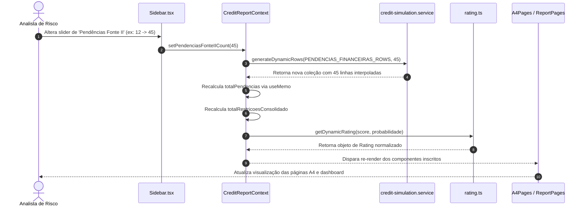
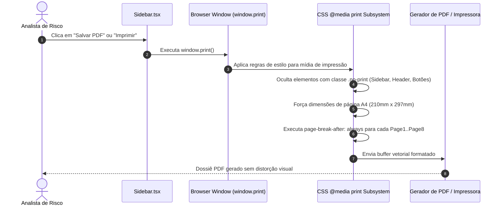

# 07 - Fluxos

## 1. Fluxo de Recálculo Reativo em Tempo Real

Demonstra a cascata de atualização disparada pela interação do operador nos controles deslizantes da Sidebar.

---

## 2. Fluxo de Impressão Vetorial / Exportação de PDF

