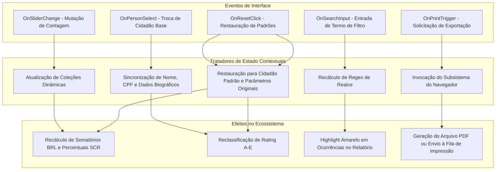

# 08 - Eventos

Na arquitetura atual baseada no React 19, os eventos de domínio são tratados através de despachos reativos desacoplados do DOM.

```mermaid
flowchart TD
    subgraph UI_Events[Eventos de Interface]
      E1[OnSliderChange - Mutação de Contagem]
      E2[OnPersonSelect - Troca de Cidadão Base]
      E3[OnSearchInput - Entrada de Termo de Filtro]
      E4[OnResetClick - Restauração de Padrões]
      E5[OnPrintTrigger - Solicitação de Exportação]
    end

    subgraph State_Handlers[Tratadores de Estado Contextuais]
      H1[Atualização de Coleções Dinâmicas]
      H2[Sincronização de Nome, CPF e Dados Biográficos]
      H3[Recálculo de Regex de Realce]
      H4[Restauração para Cidadão Padrão e Parâmetros Originais]
      H5[Invocação do Subsistema do Navegador]
    end

    subgraph System_Outcomes[Efeitos no Ecossistema]
      O1[Recálculo de Somatórios BRL e Percentuais SCR]
      O2[Reclassificação de Rating A-E]
      O3[Highlight Amarelo em Ocorrências no Relatório]
      O4[Geração do Arquivo PDF ou Envio à Fila de Impressão]
    end

    E1 --> H1 --> O1
    E2 --> H2 --> O2
    E3 --> H3 --> O3
    E4 --> H4 --> O1
    E4 --> H4 --> O2
    E5 --> H5 --> O4
```
