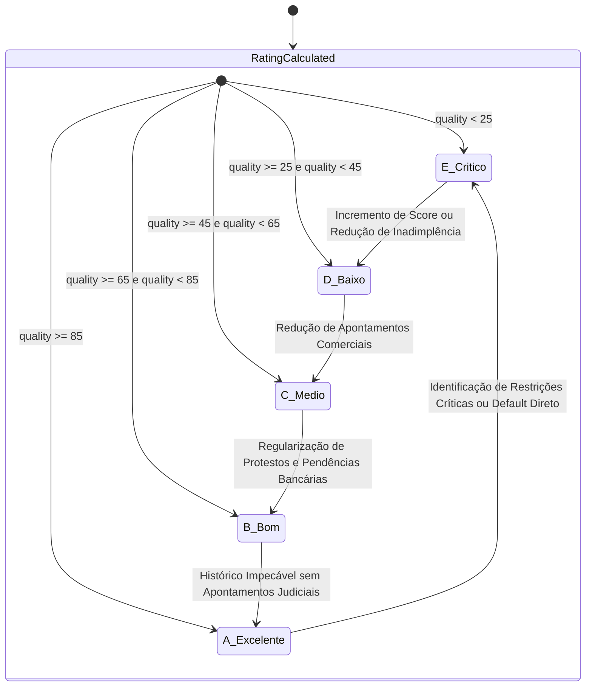
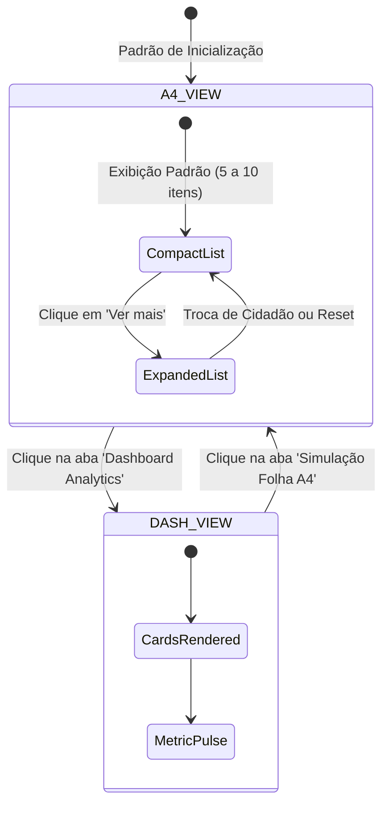

# 09 - State Machines

## 1. Ciclo de Vida do Rating de Risco

A classificação de risco transita de acordo com uma qualidade sintética ponderada:
`quality = (score / 10) * 0.5 + (100 - probabilidade) * 0.5`

---

## 2. Máquina de Estados da Interface (Tabs de Visualização)

