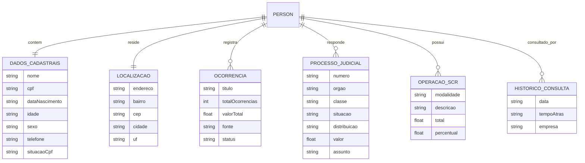

# 10 - Modelo Conceitual

Mapeamento das entidades lógicas, agregados e *Value Objects* manipulados pela plataforma.

```mermaid
erDiagram
    PERSON ||--|| DADOS_CADASTRAIS : contem
    PERSON ||--|| LOCALIZACAO : reside
    PERSON ||--o{ OCORRENCIA : registra
    PERSON ||--o{ PROCESSO_JUDICIAL : responde
    PERSON ||--o{ OPERACAO_SCR : possui
    PERSON ||--o{ HISTORICO_CONSULTA : consultado_por

    DADOS_CADASTRAIS {
        string nome
        string cpf
        string dataNascimento
        string idade
        string sexo
        string telefone
        string situacaoCpf
    }

    LOCALIZACAO {
        string endereco
        string bairro
        string cep
        string cidade
        string uf
    }

    OCORRENCIA {
        string titulo
        int totalOcorrencias
        float valorTotal
        string fonte
        string status
    }

    PROCESSO_JUDICIAL {
        string numero
        string orgao
        string classe
        string situacao
        string distribuicao
        float valor
        string assunto
    }

    OPERACAO_SCR {
        string modalidade
        string descricao
        float total
        float percentual
    }

    HISTORICO_CONSULTA {
        string data
        string tempoAtras
        string empresa
    }
```
