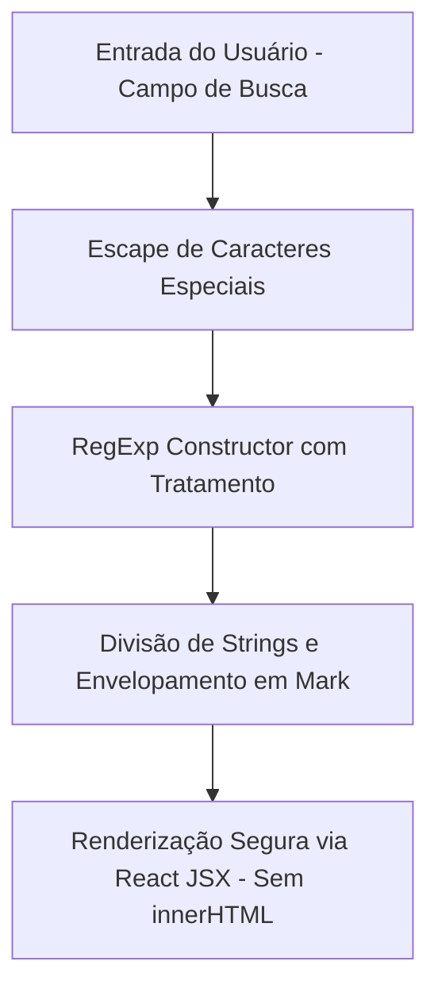

# 12 - Segurança e Conformidade Legal

## 1. Conformidade com a LGPD (Lei 13.709/18)
- **Minuta de Declaração Formal:** O relatório incorpora na Página 8 uma minuta vinculante de conformidade legal, delimitando a finalidade exclusiva das informações para análise de risco de crédito.
- **Não Persistência de Dados Pessoais (PII):** A versão frontend opera integralmente em memória (*in-memory client state*). Nenhuma informação digitada pelo usuário é enviada para servidores de terceiros ou persistida em cookies/LocalStorage sem consentimento.
- **Sanitização de Dados:** O catálogo sintético (`peopleBank.ts` e `mockDataBank.ts`) utiliza dados fictícios estruturados estritamente para simulação de perícia.

---

## 2. Sanitização de Entrada e Defesa contra Vulnerabilidades

- **Prevenção de XSS:** O realce de texto (*highlighting*) implementado em `A4Pages.tsx` não utiliza `dangerouslySetInnerHTML`. O texto correspondente é decomposto via `String.prototype.split` e os fragmentos são renderizados como nós nativos React (elemento `<mark>`), impedindo injeção de scripts maliciosos.
