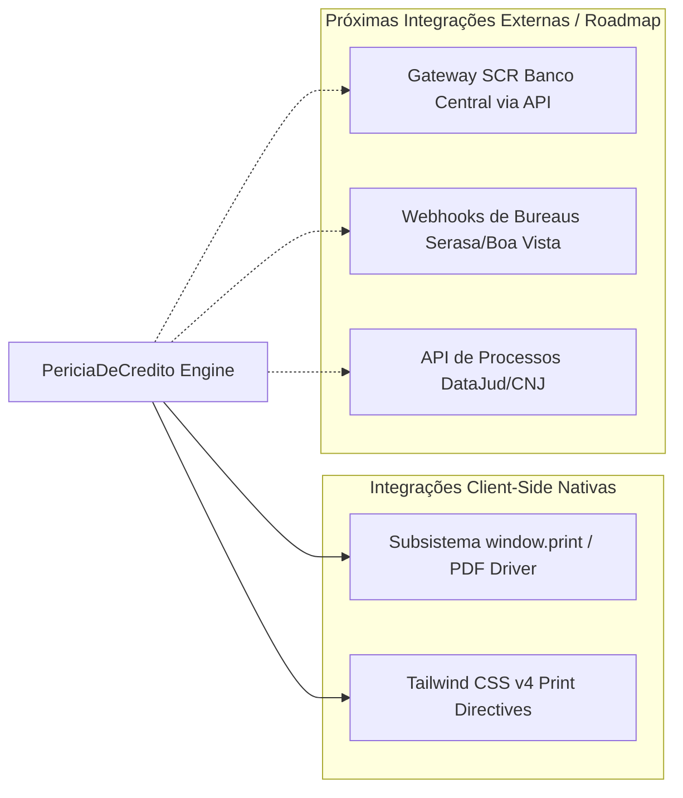

# 13 - Integrações

O sistema foi desenhado para atuar em duas frentes de integração:

---

## Detalhamento de Integrações Nativas
1. **Subsistema de Impressão do Navegador (`window.print`):** 
   - Habilitado por regras do Tailwind CSS v4 (`print:overflow-visible`, `print:shadow-none`, `print:p-10`).
   - Força fidelidade cromática com a diretiva `-webkit-print-color-adjust: exact !important`.
2. **Font Providers:**
   - **Inter:** Utilizada para textos corridos e legibilidade tabular via Google Fonts.
   - **JetBrains Mono:** Utilizada para CPF, protocolos e dados numéricos tabulados.
   - **Satoshi:** Tipografia de títulos com alto impacto executivo via Fontshare CDN.
