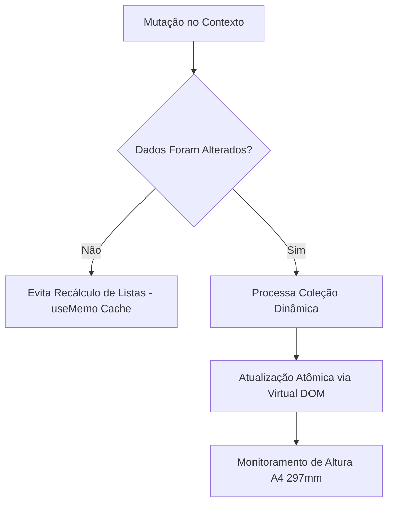

# 14 - Observabilidade e Métricas de Execução

## 1. Monitoramento de Performance de Renderização
A renderização simultânea de 8 páginas A4 com dezenas de tabelas dinâmicas exige controle rígido de processamento no navegador:

---

## 2. Indicadores Críticos de Qualidade (SLIs de Interface)
- **Tempo de Resposta dos Sliders (Input-to-Render):** Mantido abaixo de **16ms** (60 FPS) através da memoização independente de cada tabela (`pendenciasRows`, `protestosRows`, `processosRows`).
- **Conformidade Geométrica de Impressão:** Cada página deve possuir exatamente `min-height: 297mm` e respeitar `page-break-inside: avoid` para prevenir quebras indesejadas de linhas de tabelas.
- **Consistência Criptográfica de Protocolo:** Identificador pseudoaleatório exibido no rodapé (`d3e431fe9f65410`) serve como âncora de conferência de versão documental.
