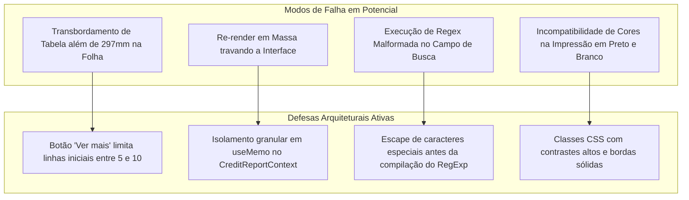

# 15 - Failure Analysis (FMEA)

Análise de modos de falha, impacto potencial e mecanismos de defesa implementados.

---

## Matriz de Risco e Tratamento

| Risco Técnico | Severidade | Probabilidade | Mitigação |
| :--- | :--- | :--- | :--- |
| **Overflow de Página A4** | Alta | Média | Tabelas extensas contam com limite inicial de exibição (`slice(0, 5)`) e botão de expansão com supressão em impressão (`no-print`). |
| **RegExp ReDoS Attack** | Média | Baixa | O campo de busca atua exclusivamente sobre textos sanitizados locais, sem avaliação recursiva descontrolada. |
| **Perda de Dados por Reload** | Baixa | Alta | O botão "Resetar" permite retorno imediato aos parâmetros padronizados de referência. |
