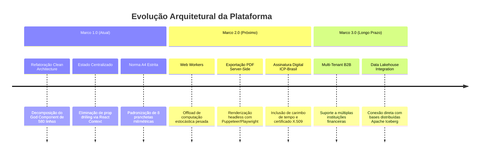

# 16 - Evolução / Roadmap

Linha do tempo e planejamento arquitetural para a plataforma para os próximos ciclos.

```mermaid
timeline
    title Evolução Arquitetural da Plataforma
    section Marco 1.0 (Atual)
      Refatoração Clean Architecture : Decomposição do God Component de 580 linhas
      Estado Centralizado : Eliminação de prop drilling via React Context
      Norma A4 Estrita : Padronização de 8 pranchetas milimétricas
    section Marco 2.0 (Próximo)
      Web Workers : Offload de computação estocástica pesada
      Exportação PDF Server-Side : Renderização headless com Puppeteer/Playwright
      Assinatura Digital ICP-Brasil : Inclusão de carimbo de tempo e certificado X.509
    section Marco 3.0 (Longo Prazo)
      Multi-Tenant B2B : Suporte a múltiplas instituições financeiras
      Data Lakehouse Integration : Conexão direta com bases distribuídas Apache Iceberg
```
